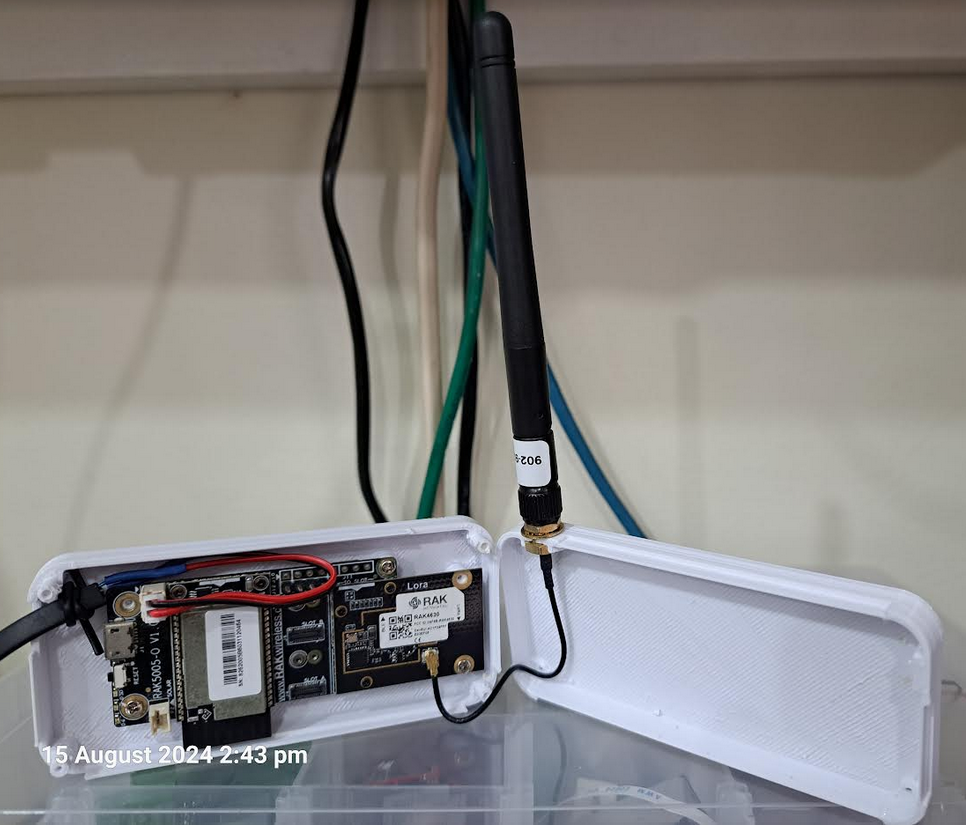
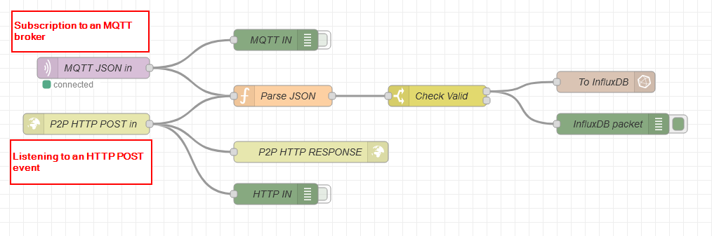

# WisBlock LoRa P2P Gateway to MQTT Broker or HTTP Post service
|  |  |  |    
| :-: | :-: | :-: | 

----


# Overview
LoRa P2P communication is an alternative to LoRaWAN. LoRa P2P's advantages are in the simple setup for small private networks without the need for an (expensive) LoRaWAN gateway and it doesn't require a LoRaWAN server (local or in the cloud). But LoRa P2P lacks features like packet encryption, node addresses and confirmed transmissions. However, with LoRa P2P a low cost gateway can be build with WisBlock modules to forward node data to a local server or to the cloud.     

This PoC shows how to setup a simple LoRa P2P gateway, receive data from sensor nodes and forward them to an MQTT broker or an HTTP Post service.    

----

# Requirements

## Gateway hardware
In this PoC we are using the ESP32 based RAK11200 and it's built-in WiFi for the gateway. As the RAK11200 has no built-in LoRa transceiver, the RAK13300 LoRa module is used:

- [WisBlock Base Board RAK19007](https://store.rakwireless.com/products/rak19007-wisblock-base-board-2nd-gen)
- [WisBlock Core Module RAK11200](https://store.rakwireless.com/products/wiscore-esp32-module-rak11200)
- [WisBlock LoRa Module RAK13300](https://store.rakwireless.com/products/rak13300-wisblock-lpwan)

----

#### ⚠️ IMPORTANT ⚠️        
The RAK11200/ESP32 is a power-hungry device during boot-up, specially when the WiFi interface is enabled.    
The RAK19007 Base Board cannot supply enough current from it's USB port during the boot sequence of the RAK11200 when WiFi is enabled.    
#### _**It is required to connect a battery to the Base Board to ensure a proper boot-up of the RAK11200!**_

----

### My setup with a 3D printed enclosure:

<center></center>

----
----

📝 INFO 📝    
In this setup no battery is required, because I am using a modified WisBlock Base Board that can generate enough supply current for the RAK11200 during boot-up.    
<sup>(and yes, it is the same hardware that was used for the [Meshtastic-Sensor-Network](https://github.com/beegee-tokyo/Meshtastic-Sensor-Network))</sup>

----

## Sensor node hardware
In this example no specific sensor node is included.    

Most of my WisBlock examples can be switched between LoRaWAN and LoRa P2P communication. And my examples use Cayenne LPP to format the payload. This allows to basically connect any of my exising sensor devices to this P2P gateway without any code changes. The only thing that has to be done is to switch the LoRa protocol from LoRaWAN to LoRa P2P and setup the same parameters as on the gateway.

Compatible WisBlock Sensor applications:
- [WisBlock-Seismic-Sensor](https://github.com/beegee-tokyo/WisBlock-Seismic-Sensor)
- [RUI3 door/window status](https://github.com/beegee-tokyo/RUI3-RAK13011)
- [RAK4631-Kit-4-RAK1906](https://github.com/beegee-tokyo/RAK4631-Kit-4-RAK1906)
- [RAK4631-Kit-1-RAK1901-RAK1902-RAK1903](https://github.com/beegee-tokyo/RAK4631-Kit-1-RAK1901-RAK1902-RAK1903)
- [WisBlock Indoor Air Quality Sensor](https://github.com/beegee-tokyo/WisBlock-IAQ-PM-CO2-VOC-EPD)
- [RAK10702-Indoor-Comfort](https://github.com/RAKWireless/RAK10702-Indoor-Comfort) (requires latest source code version >= V1.1.0)
- [WisBlock-Sensor-For-LoRaWAN](https://github.com/beegee-tokyo/WisBlock-Sensor-For-LoRaWAN)

----

#### ⚠️ IMPORTANT ⚠️        
The LoRa P2P gateway requires that each node has a unique node ID. The above examples generate this unique node ID from the LoRaWAN DevEUI.   
WisBlock Core Modules using Arduino based firmware _**DO NOT**_ have a factory flashed DevEUI, they will create the same node ID, which still would work, but it is not possible to determine at the end point (MQTT broker or HTTP API server) from which node the data is coming.    
#### _**It is required to setup all P2P nodes with a unique DevEUI.**_    
As all above examples are base on the WisBlock API, the DevEUI can be setup with the AT command AT+DEVEUI=xxxxxxxx. (⚠️ The modules have to be set to LoRaWAN mode first using the AT command AT+NWM=1 ⚠️)

Excemption are RUI3 based WisBlock Core modules. These modules have a factory flashed unique DevEUI!

----

## Setup of the P2P gateway (and end nodes)

In the example repo are two sets of source code. They are 90% identical, the only difference is that _**LoRa-P2P-MQTT-Gateway**_ includes the option to publish topics to an MQTT broker, while _**LoRa-P2P-POST-Gateway**_ is using HTTP Post to send information to an HTTP endpoint.    


### Common setup for both source codes
Both applications are based on the [WisBlock-API-V2](https://github.com/beegee-tokyo/WisBlock-API-V2), which provides the complete BLE, WiFi and LoRa handlers.    
- BLE is used for setup and wireless debugging (e.g. through WisBlock Tool Box or a BLE Serial Terminal)    
- WiFi is used to connect to a WiFi AP router   
- LoRa is used to receive the data packets from the sensor nodes    

The WisBlock API V2 already handles the setup of all these interfaces. BLE and LoRa are activated automatically. WiFi requires a call to _**`init_wifi()`**_, which is done in the _**`setup_wifi()`**_ function.

#### LoRa P2P setup
All devices in a LoRa P2P network have to be setup to the same LoRa configuration (frequency, bandwidth, spreading factor, ...). These settings can be done over the USB connection with AT commands. The AT commands are identical whether a WisBlock based node or a RUI3 based node is used.    
These settings have to be done on both the sensor nodes and the LoRa P2P gateway.

| Command | Action |
| --- | --- |
| AT+NWM=0 | Switch working mode to LoRa P2P ⚠️ Device will reset ⚠️ |
| AT+P2P=916100000:7:0:0:8:22 | Setup LoRa P2P parameters. <br> Here used: <br> Frequency 916.1 MHz <br> Spreading factor 7 <br> Bandwidth 125 kHz <br> Coding Rate 4/5 <br> Preamble Length 8 |
| ATZ | Reboot the device to make sure the P2P settings are applied |

#### WiFi setup
The LoRa P2P gateway application is using the _**MultiWiFi**_ function of the RAK11200/ESP32. This allows to setup multiple WiFi AP credentials and the ESP32 will automatically connect to the first available AP.    

⚠️ At the release time of the code, the AP credentials are hard coded in the _**`wifi_post,cpp`**_ and _**`wifi_mqtt.cpp`**_ files. They must be setup correct in the file.    
<sup>(As an improvement, it is planned to add the option to setup the AP credentials with AT commands.)</sup>    

```cpp
//* ********************************************************* */
//* Requires WiFi credentials setup through WisBlock Toolbox  */
//* or through AT commands                                    */
//* Until AT commands implemented, set them here manually     */
//* ********************************************************* */
/** Primary SSID of local WiFi network */
String ssid_prim = "YOUR WIFI AP #1";
/** Secondary SSID of local WiFi network */
String ssid_sec = "YOUR WIFI AP #2";
/** Password for primary local WiFi network */
String pw_prim = "YOUR WIFI AP #1 PASSWORD";
/** Password for secondary local WiFi network */
String pw_sec = "YOUR WIFI AP #2 PASSWORD";
```

### Setup the MQTT connection

If the MQTT version of the code is used, the connection credentials for the MQTT broker have to be setup in the _**`wifi_mqtt.cpp`**_ file.    
<sup>(As an improvement, it is planned to add the option to setup the MQTT credentials with AT commands.)</sup>

```cpp
// Replace it with your MQTT Broker IP address or domain
const char *mqtt_server = "YOUR BROKER URL/IP ADDRESS";

// Define an ID to indicate the device, 
// If it is the same as other devices which connect the same mqtt server,
// it will lead to the failure to connect to the mqtt server
const char *mqttClientId = "esp32";

// if need username and password to connect mqtt server, they cannot be NULL.
const char *mqttUsername = "YOUR BROKER USER NAME";
const char *mqttPassword = "YOUR BROKER PASSWORD";
```

⚠️ Depending on the used MQTT broker additional credentials might be required ⚠️    
More information how the setup a connection can be found in the [PubSubClient](https://github.com/knolleary/pubsubclient) library documentation.


The MQTT topic used to publish sensor data is as well hardcoded in the _**`mqtt_parse_send.cpp`**_ file and you should change it to your requirements:
```cpp
// Create topic as char array
snprintf(mqtt_topic, 64, "msh/SG_923_bg/2/P2P/%02X%02X%02X%02X", g_lorawan_settings.node_device_eui[4], g_lorawan_settings.node_device_eui[5],
		 g_lorawan_settings.node_device_eui[6], g_lorawan_settings.node_device_eui[7]);
```

It includes the P2P Gateway node ID into the topic. This will be helpful if multiple networks are publishing sensor data to the same MQTT broker.    

The sensor data is published in JSON format, this makes it easier to decode the data later. Beside of the sensor values, it includes as well the node ID of the sending sensor node. This allows to distinguish between different sensors using the same LoRa P2P gateway.

```json
{
	"humidity_2":44,
	"temperature_3":27.89999962,
	"illuminance_5":28,
	"concentration_35":1013,
	"voc_40":31,
	"voc_41":47,
	"voc_42":57,
	"presence_48":1,
	"node_id":4262174017
}
```

From the MQTT broker any other device can subscribe to the topic to receive the sensor data.

### Setup the HTTP connection

⚠️ The HTTP connection allows to send the sensor data either as formatted JSON or as a raw uint8_t array.    
To switch between the two options, the USE_RAW compiler flag in _**platformio.ini**_ is used. ⚠️    
```ini
-D USE_RAW=0          ; 1 = send RAW payload, 0 = send JSON payload
```

If the HTTP API version of the code is used, the connection information has to be setup in the file _**`wifi_post.cpp`**_    
<sup>(As an improvement, it is planned to add the option to setup the HTTP connection with AT commands.)</sup>

```cpp
// Replace it with your HTTP POST API IP address or domain
const char *post_server = "http://YOUR_SERVER_URL";
```

Posting the sensor node data is done with a simple, unsecured POST call and the content is declared as `application/json`

```cpp
	// Start HTTP client
	http.begin(client, post_server);

	// Specify content-type header
	http.addHeader("Content-Type", "application/json");

	// Send HTTP POST request
	int httpResponseCode = http.POST((uint8_t*) payload, len);

	http.end();
```

It includes the P2P Gateway node ID into the topic. This will be helpful if multiple networks are publishing sensor data to the same server.    

The sensor data is published in JSON format, this makes it easier to decode the data later. Beside of the sensor values, it includes as well the node ID of the sending sensor node. This allows to distinguish between different sensors using the same LoRa P2P gateway.

```json
{
	"humidity_2":44,
	"temperature_3":27.89999962,
	"illuminance_5":28,
	"concentration_35":1013,
	"voc_40":31,
	"voc_41":47,
	"voc_42":57,
	"presence_48":1,
	"node_id":4262174017
}
```

----

## Setup the end point to receive the data

For testing an end-point is setup with NodeRED.    
One flow combined both MQTT and HTTP POST variants, as the decoding of the data is the same for both.

<center></center>

As usually, I am using InfluxDB and Grafana for the sensor data visualization.

----
----

# LoRa® is a registered trademark or service mark of Semtech Corporation or its affiliates. 


# LoRaWAN® is a licensed mark.

----
----